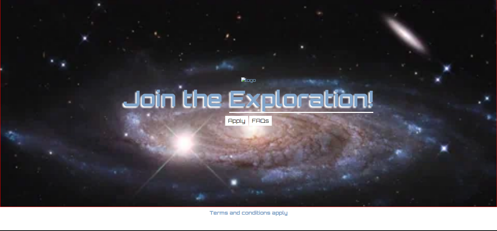

# Space Exploration Site

This is a simple space exploration site with a hero section that includes a background image, a logo, and call-to-action buttons. The project is styled using CSS and designed to be responsive.

## Live Demo

[Click here to view the live demo](https://scrimba-horatio-space-exploration.netlify.app/)

## Screenshot



## Features

- **Hero Section**: A full-screen hero section with a galaxy background image, logo, and two call-to-action buttons: "Apply" and "FAQs".
- **Responsive Design**: The layout adjusts to different screen sizes to ensure a good user experience on all devices.
- **Stylish Buttons**: Call-to-action buttons are styled to grab attention and fit the space exploration theme.

## Technologies Used

- **HTML5**: For the structure of the webpage.
- **CSS3**: For styling the webpage, including the layout of the hero section, fonts, and buttons.
- **Google Fonts**: The "Orbitron" font is used to match the space theme.
  
## Setup Instructions

1. Clone the repository to your local machine.
   ```bash
   git clone https://github.com/your-username/space-exploration-site.git
